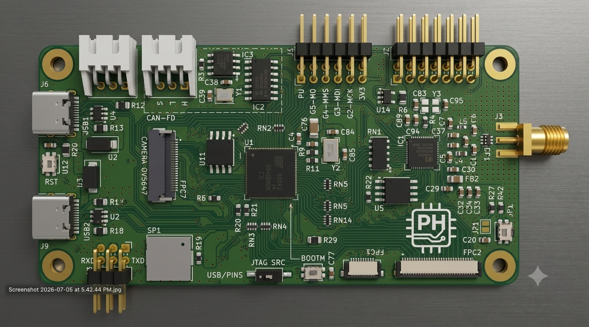
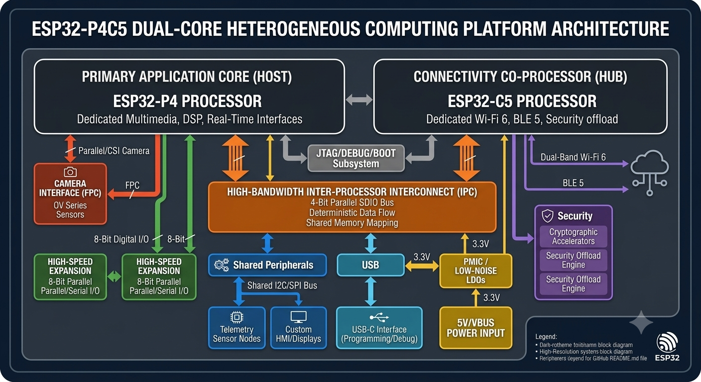

# Modular ESP32 Heterogeneous Computing Platform (ESP32-P4 + ESP32-C5)

<div align="center">
  
  <br>
  <em>4-layer PCB diagram.</em>
</div>


## 📑 Quick Access
* [**📂 View Project Schematics (PDF)**](./Schematics/ESP32P4C5_Board.pdf)
* [**📂 View PCB Layout (PDF)**](./PCB_Layout/ESP32P4C5_Board.pdf)

## 📌 Project Overview

A production-grade, high-performance development platform engineered to serve as a modular, reusable core for edge computing, high-bandwidth multimedia processing, and synchronized wireless gateways. 

This repository showcases an advanced asynchronous, dual-MCU topology that isolates intensive computational and real-time interface operations from wireless network stack overhead. By decoupling heavy application logic from communication tasks via a high-speed parallel bus interconnect, the architecture guarantees deterministic processing latency and maximum deployment flexibility across diverse industrial and machine vision domains.

---

## 🏗 System Architecture & Design Philosophy

The system architecture purposefully segregates application compute from wireless networking to maximize throughput and guarantee real-time predictability.

<div align="center">
  
  <br>
  <em>System architecture diagram.</em>
</div>

### 1. Primary Workstation Core: Espressif ESP32-P4
The **ESP32-P4** acts as the primary host, running application firmwares, digital signal processing (DSP), and complex interface state-machines. It interfaces with high-bandwidth peripherals without experiencing interrupt starvation caused by networking radio activity.
*   **Camera FPC Interface:** A dedicated 0.5mm pitch FPC interface supporting parallel/MIPI CSI camera modules. Designed for minimal trace-length skew to support synchronous high-frame-rate image acquisition and local edge execution.
*   **8-Bit Parallel Subsystem:** Exposes a high-speed, parallel digital bus mapped directly onto low-latency GPIO matrices. Engineered to interface directly with legacy parallel hardware, hardware accelerators, rapid external analog-to-digital converters (ADCs), or high-refresh TFT displays.

### 2. Network Co-Processor Subsystem: Espressif ESP32-C5
The **ESP32-C5** operates as a standalone network engine, handling the entirety of the link layer, cryptographic handshakes, and transport layer protocol stacks.
*   **Dual-Band Wi-Fi 6:** Utilizes native 2.4 GHz and 5 GHz radios, providing network resilience against RF congestion, significantly improving communication reliability in dense industrial environments.
*   **Bluetooth 5 (LE):** Managed independently for local out-of-band provisioning, decentralized mesh topologies, and real-time proximity sensing.

### 3. Inter-Processor Communication (IPC): 4-Bit SDIO Bus
Processor synchronization is achieved over a hardware-managed **4-bit SDIO parallel interface**. Unlike highly bottlenecked SPI or serial UART abstractions, this interconnect introduces wide data paths capable of handling high-rate simultaneous dual-band Wi-Fi data routing concurrently with video capture or high-speed I/O manipulation.

---

## 🔌 Hardware Interface Mapping

To fulfill its requirements as a universally integrable module, the layout strictly organizes peripheral pin assignments to mitigate trace crossover and manage signal integrity across high-speed signal groups.

| Peripheral Subsystem | Physical Interface / Interconnect | Target Engineering Application |
| :--- | :--- | :--- |
| **Edge Vision** | 0.5mm Pitch Parallel FPC | CMOS Image Sensors, Edge AI Machine Vision, Asset Monitoring |
| **Parallel Bus** | Low-Impedance GPIO Headers | Legacy Bus Bridging, High-Speed External Converters, Parallel LCDs |
| **Synchronous Serial**| Hardware SPI Bus Headers | High-Frequency IMUs, External Flash Memory, Low-Level Controllers |
| **Asynchronous Serial**| Dedicated Hardware UART | isolated Console Debugging, GNSS Modems, Cellular Modems |
| **Control Bus** | Fast-Mode Plus (Fm+) I2C | Local Telemetry Sensors, Cryptographic Co-Processors, EEPROMs, HMIs |
| **System I/O & Power** | Dual Independent USB-C | Native USB 2.0 Subsystems, Dedicated Programming/Debugging Bridges |

---

## 🚀 Target Production Domain Implementations

*   **Distributed Edge Machine Vision:** Acquires high-fidelity pixel matrices via the FPC interface, executes localized machine learning inference directly on the application core, and marshals real-time vectors safely out through dual-band Wi-Fi 6.
*   **Industrial Automation & Edge HMI:** Interconnects cleanly with external motor controllers, fieldbuses, or dense sensor pods via the 8-bit parallel, SPI, or I2C busses while handling real-time visualization on local touch displays.
*   **Secure IoT Sensor Hubs:** Operates as a security gateway, pulling data from localized wireless sensor clusters via BLE 5 and uploading encrypted data streams to enterprise cloud nodes across secure 5 GHz channels.

---

## 🛠 System Compilation & Initialization Workflow

### Technical Prerequisites
*   **Espressif ESP-IDF SDK v5.3+** (or later stable branches containing target support for the ESP32-P4 architecture).
*   Standard dual-channel USB-to-UART bridging hardware or explicit configuration via internal USB routing layers.

### Compiling and Deployment
To compile and flash the primary application workspace onto the main ESP32-P4 target engine:

```bash
# Navigate to the core processor application repository
cd firmware/main_p4

# Set compilation targets explicitly to the ESP32-P4 hardware register maps
idf.py set-target esp32p4

# Execute target compilation and code optimization pass
idf.py build

# Flash binary payloads onto the hardware module and open serial communication lines
idf.py -p [YOUR_TARGET_PORT] flash monitor
```

## 📝 License & Open Source Compliance
This architecture and firmware codebase are released under the terms of the open-source MIT License. For complete text and details regarding reuse rights, consult the accompanying LICENSE file.

## 🎓 About the Author
I am a recent **Electrical Engineering graduate from the University of British Columbia (UBC)**. This project represents my ability to transition theoretical academic knowledge into a complex, manufacturable high-speed digital system.